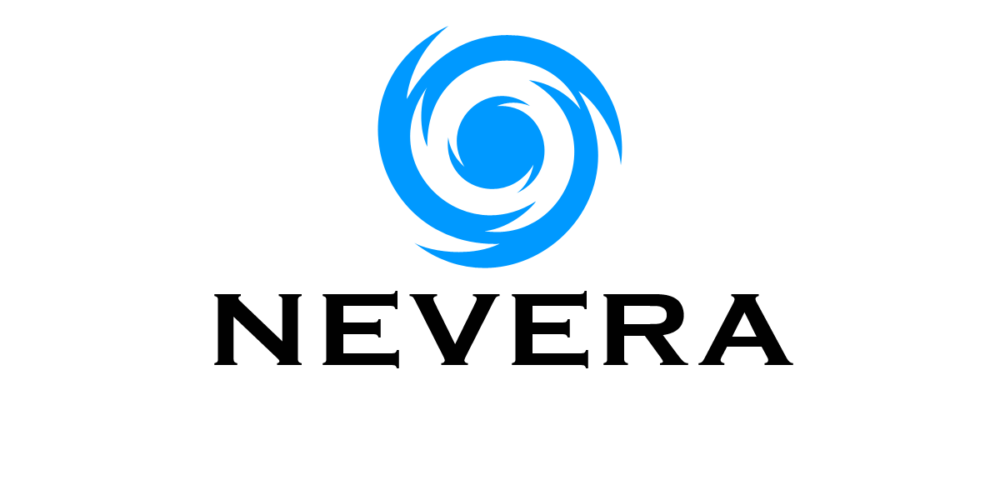

# Nevera

Kulturno-identitetsko društvo Nevera je osnovano u studenom 2021. godine i djeluje na području Hrvatskog primorja. Ciljevi društva su širenje hrvatskog, europskog i primorskog identiteta među građanima.

## Aktivnosti

Planirane aktivnosti društva su organizacija kulturnih, sportskih i socijalnih aktivnosti (debate, konferencije, predavanja, intervjui, pisanje članaka, izleti, planinarenje i sl.). U dijelu [Pregled aktivnosti](aktivnosti/index.md) i na našim društvenim mrežama možete pronaći informacije o posljednjim aktivnostima.

### Kako se uključiti

Članstvo u društva je otvoreno za sve punoljetne državljane Republike Hrvatske čije članstvo odobri vodstvo. Za razliku od većine društava, Kulturno-identitetsko društvo Nevera ne učlanjuje na masovan način, nego samo one koji su spremni aktivno sudjelovati u aktivnostima (kvaliteta ispred kvantitete).

## Kontakt

Za sva pitanja oko društva obratite nam se na našu e-mail adresu: [drustvonevera@gmail.com](mailto:drustvonevera@gmail.com)

### Društvene mreže

- [Facebook](https://www.facebook.com/kid.nevera)
- [GitHub](https://github.com/kid-nevera)
- [YouTube](https://youtube.com/channel/UCRZv-A0qImtElgjbwwffYOg)
